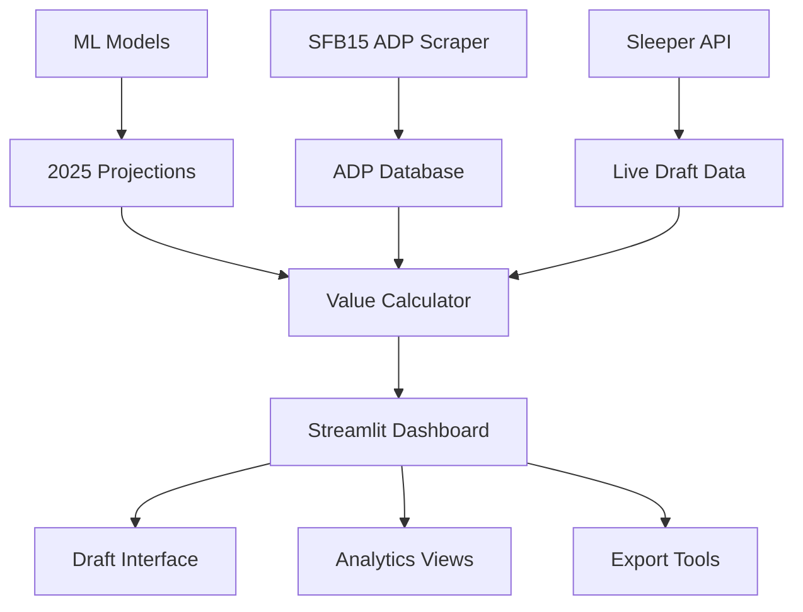

# SFB15 Fantasy Football Draft Dashboard - Complete Development Plan

## 🎯 **Project Overview**

Build a comprehensive, modern fantasy football draft dashboard specifically optimized for Scott Fish Bowl 15 (SFB15) that integrates advanced projections, live ADP data, Sleeper API integration, and sophisticated analytics to provide the ultimate drafting advantage.

## 📋 **Core Requirements & Features**

### **1. Foundation Features**
- Advanced projection system integration (existing ML models)
- Scott Fish Bowl 15 specific ADP integration
- Live Sleeper draft synchronization
- Value-based drafting (VBD) calculations
- Dynamic tier management
- Sleeper identification algorithms

### **2. Live Integration Features**
- Real-time ADP updates from [GoingFor2 SFB15 ADP](https://goingfor2.com/sfb15adp/)
- Sleeper API integration for live draft tracking
- Market intelligence and value alerts
- Multi-source ADP aggregation

### **3. Advanced Analytics**
- Opportunity scoring system
- Projection component breakdown
- Risk-adjusted rankings
- Team composition optimization

---

## 🏗️ **Technical Architecture**

### **Tech Stack**
```python
# Frontend Framework
- Streamlit (rapid development, analytics-focused)
- Plotly/Altair (interactive visualizations)

# Backend & Data Processing
- Python 3.9+
- pandas, numpy (data manipulation)
- requests (API calls)
- sqlite3 (local data storage)
- schedule (automated data updates)

# APIs & Data Sources
- Sleeper API (draft integration)
- GoingFor2 SFB15 ADP (web scraping)
- Custom projection models (existing)

# Deployment
- Streamlit Cloud / Docker
- GitHub Actions (CI/CD)
```

### **Data Flow Architecture**


---

## 📅 **Development Timeline & Phases**

## **PHASE 1: Foundation Setup (8-10 hours)**

### **Step 1.1: Environment & Project Structure (1 hour)**
```bash
# Project structure
sfb15_draft_dashboard/
├── app.py                 # Main Streamlit app
├── data/
│   ├── projections/       # ML model outputs
│   ├── adp/              # ADP data storage
│   └── drafts/           # Saved draft states
├── src/
│   ├── data_sources/     # API integrations
│   ├── calculators/      # VBD, sleeper scoring
│   ├── streamlit_components/ # UI components
│   └── utils/            # Helper functions
├── config/
│   └── settings.py       # Configuration
└── requirements.txt
```

**Deliverables:**
- Repository setup with proper structure
- Virtual environment configuration
- Dependencies installation

### **Step 1.2: Data Integration Layer (3-4 hours)**

#### **1.2a: Projection Data Integration**
```python
# src/data_sources/projections.py
class ProjectionLoader:
    def load_2025_projections(self):
        """Load existing ML model projections"""
        
    def calculate_vbd_scores(self, projections, scoring_system):
        """Calculate Value Based Drafting scores"""
        
    def assign_dynamic_tiers(self, projections):
        """Create tier boundaries based on value gaps"""
```

#### **1.2b: SFB15 ADP Integration** 
```python
# src/data_sources/adp_scraper.py
class SFB15ADPScraper:
    def scrape_goingfor2_adp(self):
        """Scrape current ADP from GoingFor2"""
        # Target: https://goingfor2.com/sfb15adp/
        
    def aggregate_multiple_adp_sources(self):
        """Combine multiple ADP sources for comprehensive data"""
        
    def calculate_adp_trends(self):
        """Track ADP movement over time"""
```

**Key ADP Integration Points:**
- Parse the 291+ player ADP table from GoingFor2
- Store historical ADP data for trend analysis
- Calculate ADP vs Projection value gaps
- Update ADP data every 4-6 hours automatically

#### **1.2c: Sleeper API Integration**
```python
# src/data_sources/sleeper_api.py
class SleeperDraftTracker:
    def connect_to_draft(self, draft_id):
        """Connect to live Sleeper draft"""
        
    def get_draft_state(self):
        """Get current draft picks and remaining players"""
        
    def track_draft_picks_realtime(self):
        """Stream live draft updates"""
        
    def sync_local_state(self):
        """Sync dashboard state with Sleeper draft"""
```

**Sleeper API Endpoints:**
- `GET /draft/{draft_id}` - Draft metadata
- `GET /draft/{draft_id}/picks` - All picks in draft
- `GET /draft/{draft_id}/traded_picks` - Traded picks
- WebSocket for real-time updates

### **Step 1.3: Core Calculation Engine (2-3 hours)**

#### **Value Calculation System**
```python
# src/calculators/value_engine.py
class ValueCalculator:
    def calculate_vbd(self, player_projection, replacement_level):
        """Value Based Drafting calculation"""
        
    def calculate_opportunity_score(self, player_data):
        """Opportunity indicators (targets, carries, etc.)"""
        
    def calculate_sleeper_score(self, projection, adp, opportunity):
        """Comprehensive sleeper identification"""
        
    def calculate_positional_scarcity(self, position_projections):
        """Position scarcity modeling"""
```

#### **Tier Management System**
```python
# src/calculators/tier_manager.py
class TierManager:
    def create_dynamic_tiers(self, sorted_players):
        """Create tiers based on value gaps"""
        
    def update_tiers_post_pick(self, remaining_players):
        """Recalculate tiers after each pick"""
        
    def get_tier_recommendations(self, current_roster):
        """Suggest tier targets based on roster construction"""
```

**Deliverables:**
- Complete data integration layer
- Core value calculation engine
- ADP scraping system functional
- Sleeper API connection established

---

## **PHASE 2: Core Dashboard Development (10-12 hours)**

### **Step 2.1: Main Dashboard UI (4-5 hours)**

#### **Dashboard Layout Structure**
```python
# app.py - Main Streamlit Application
def main():
    st.set_page_config(
        page_title="SFB15 Draft Dashboard",
        layout="wide",
        initial_sidebar_state="expanded"
    )
    
    # Sidebar Configuration
    with st.sidebar:
        draft_config_panel()
        sleeper_connection_panel()
        
    # Main Content Tabs
    tab1, tab2, tab3, tab4 = st.tabs([
        "🎯 Draft Board", 
        "📊 Analytics", 
        "🔍 Player Research", 
        "📋 My Team"
    ])
```

#### **Draft Board Interface**
```python
# src/streamlit_components/draft_board.py
def render_draft_board():
    """Main draft interface with player table"""
    
    # Filtering controls
    col1, col2, col3, col4 = st.columns(4)
    with col1:
        position_filter = st.multiselect("Position", ["QB", "RB", "WR", "TE"])
    with col2:
        tier_filter = st.multiselect("Tier", ["Elite", "Tier 1", "Tier 2", etc.])
    with col3:
        team_filter = st.multiselect("Team", teams)
    with col4:
        sort_metric = st.selectbox("Sort by", ["VBD", "Projection", "Sleeper Score", "ADP Value"])
    
    # Interactive player table
    render_interactive_player_table(filtered_data)
    
    # Quick actions panel
    render_quick_actions_panel()
```

#### **Key UI Components**
- **Player Table**: Sortable, filterable, with color-coded tiers
- **Value Indicators**: VBD score, ADP delta, sleeper rating
- **Quick Actions**: Draft player, add to watch list, compare players
- **Live Updates**: Real-time sync with Sleeper draft state

### **Step 2.2: Live Draft Integration (3-4 hours)**

#### **Sleeper Draft Sync Panel**
```python
# src/streamlit_components/sleeper_sync.py
def render_sleeper_connection():
    """UI for connecting to Sleeper draft"""
    
    draft_id = st.text_input("Enter Sleeper Draft ID")
    if st.button("Connect to Draft"):
        establish_sleeper_connection(draft_id)
        
    # Display draft status
    if st.session_state.get('sleeper_connected'):
        display_draft_status()
        display_recent_picks()
        display_next_pick_recommendations()
```

#### **Real-time Draft State Management**
```python
# src/utils/draft_state.py
class DraftStateManager:
    def update_from_sleeper(self, sleeper_picks):
        """Update local state from Sleeper API"""
        
    def mark_player_drafted(self, player_id, round_pick):
        """Remove player from available pool"""
        
    def recalculate_values(self):
        """Recalculate all values after each pick"""
        
    def get_optimal_picks(self, remaining_picks):
        """AI-powered pick recommendations"""
```

### **Step 2.3: Analytics Dashboard (3 hours)**

#### **Value Analytics Panel**
```python
# src/streamlit_components/analytics.py
def render_analytics_dashboard():
    """Comprehensive analytics views"""
    
    # Value distribution charts
    plot_position_value_distribution()
    
    # ADP vs Projection scatter plot
    plot_adp_projection_scatter()
    
    # Tier boundary visualization
    plot_tier_boundaries()
    
    # Sleeper identification table
    display_top_sleepers()
```

#### **Player Research Tools**
```python
def render_player_research():
    """Deep-dive player analysis"""
    
    # Player comparison tool
    compare_players_interface()
    
    # Projection breakdown
    show_projection_components()
    
    # Historical performance context
    display_historical_context()
    
    # Opportunity analysis
    show_opportunity_metrics()
```

**Deliverables:**
- Fully functional Streamlit dashboard
- Live Sleeper integration working
- Analytics panels implemented
- Player research tools operational

---

## **PHASE 3: Advanced Features & Analytics (8-10 hours)**

### **Step 3.1: Sleeper Identification Engine (3-4 hours)**

#### **Advanced Sleeper Algorithm**
```python
# src/calculators/sleeper_engine.py
class SleeperEngine:
    def calculate_comprehensive_sleeper_score(self, player):
        """Multi-factor sleeper identification"""
        
        factors = {
            'adp_value': self.calculate_adp_value(player),
            'opportunity_score': self.calculate_opportunity(player),
            'projection_confidence': self.assess_projection_confidence(player),
            'market_inefficiency': self.detect_market_inefficiency(player),
            'breakout_indicators': self.assess_breakout_potential(player),
            'injury_recovery': self.assess_injury_recovery(player)
        }
        
        return self.weighted_sleeper_score(factors)
    
    def identify_late_round_gems(self, adp_threshold=150):
        """Find high-value players with late ADP"""
        
    def find_positional_arbitrage(self):
        """Identify position-specific value opportunities"""
```

#### **Breakout Candidate Analysis**
```python
def assess_breakout_potential(self, player):
    """Identify breakout candidates based on multiple factors"""
    
    breakout_factors = {
        'age_curve': self.check_optimal_age_range(player),
        'opportunity_change': self.analyze_situation_change(player),
        'target_projection': self.project_target_increase(player),
        'coaching_system': self.analyze_coaching_fit(player),
        'injury_recovery': self.assess_health_improvement(player)
    }
    
    return self.calculate_breakout_probability(breakout_factors)
```

### **Step 3.2: Market Intelligence System (2-3 hours)**

#### **ADP Trend Analysis**
```python
# src/analytics/market_intelligence.py
class MarketIntelligence:
    def track_adp_movement(self, days_lookback=7):
        """Track ADP changes over time"""
        
    def identify_market_inefficiencies(self):
        """Find players with projection/ADP mismatches"""
        
    def calculate_draft_urgency(self, player, current_pick):
        """Predict when player will be drafted"""
        
    def generate_value_alerts(self):
        """Alert when high-value players drop"""
```

#### **Live Market Updates**
```python
def setup_automated_updates():
    """Schedule regular data updates"""
    
    # Update ADP every 4 hours
    schedule.every(4).hours.do(update_adp_data)
    
    # Recalculate values every hour
    schedule.every().hour.do(recalculate_all_values)
    
    # Check for market inefficiencies every 30 minutes
    schedule.every(30).minutes.do(scan_market_inefficiencies)
```

### **Step 3.3: Advanced UI Features (3 hours)**

#### **Interactive Draft Simulator**
```python
# src/streamlit_components/draft_simulator.py
def render_draft_simulator():
    """Practice draft scenarios"""
    
    # Simulate draft picks
    simulate_draft_interface()
    
    # Test different strategies
    strategy_comparison_tool()
    
    # Export draft scenarios
    export_simulation_results()
```

#### **Team Construction Optimizer**
```python
def render_team_optimizer():
    """Optimal roster construction guidance"""
    
    # Position priority recommendations
    show_position_priorities()
    
    # Remaining budget allocation
    show_budget_allocation()
    
    # Stack recommendations
    show_stack_opportunities()
```

**Deliverables:**
- Advanced sleeper identification system
- Market intelligence dashboard
- Draft simulation tools
- Team optimization features

---

## **PHASE 4: Production Features & Polish (6-8 hours)**

### **Step 4.1: Export & Import Functionality (2-3 hours)**

#### **Draft Export System**
```python
# src/utils/export_tools.py
class ExportManager:
    def export_cheat_sheet(self, format='pdf'):
        """Generate printable cheat sheets"""
        
    def export_draft_results(self, format='csv'):
        """Export completed draft analysis"""
        
    def export_sleeper_targets(self):
        """Export top sleeper candidates"""
        
    def import_league_settings(self, file):
        """Import scoring/roster settings"""
```

#### **Custom League Integration**
```python
def setup_custom_scoring():
    """Configure league-specific scoring"""
    
    scoring_settings = st.form("scoring_config")
    with scoring_settings:
        qb_scoring = configure_qb_scoring()
        skill_scoring = configure_skill_scoring()
        bonus_settings = configure_bonus_scoring()
        
        if st.form_submit_button("Update Scoring"):
            recalculate_projections_with_scoring(
                qb_scoring, skill_scoring, bonus_settings
            )
```

### **Step 4.2: Mobile Optimization (2 hours)**

#### **Responsive Design Implementation**
```python
# src/streamlit_components/mobile_ui.py
def render_mobile_optimized_interface():
    """Mobile-friendly draft interface"""
    
    # Simplified mobile layout
    if is_mobile_device():
        render_mobile_draft_board()
        render_mobile_quick_actions()
    else:
        render_desktop_interface()
```

### **Step 4.3: Data Persistence & Recovery (2-3 hours)**

#### **Draft State Management**
```python
# src/utils/state_manager.py
class StateManager:
    def save_draft_state(self, draft_id):
        """Save current draft state"""
        
    def load_draft_state(self, draft_id):
        """Restore previous draft state"""
        
    def backup_to_cloud(self):
        """Backup draft data to cloud storage"""
        
    def recover_from_interruption(self):
        """Recover from connection interruptions"""
```

**Deliverables:**
- Complete export/import functionality
- Mobile-optimized interface
- Robust data persistence
- Error handling and recovery

---

## **PHASE 5: Testing & Deployment (4-6 hours)**

### **Step 5.1: Comprehensive Testing (2-3 hours)**

#### **Testing Framework**
```python
# tests/test_suite.py
def test_adp_integration():
    """Test ADP scraping and data quality"""
    
def test_sleeper_api_integration():
    """Test Sleeper API connection and data sync"""
    
def test_value_calculations():
    """Verify VBD and sleeper score accuracy"""
    
def test_draft_state_management():
    """Test draft state persistence and recovery"""
```

#### **Performance Testing**
- Load testing with 300+ players
- Real-time update responsiveness
- Memory usage optimization
- API rate limit handling

### **Step 5.2: Deployment Setup (2-3 hours)**

#### **Production Deployment**
```yaml
# docker-compose.yml
version: '3.8'
services:
  sfb15-dashboard:
    build: .
    ports:
      - "8501:8501"
    environment:
      - SLEEPER_API_KEY=${SLEEPER_API_KEY}
      - ADP_UPDATE_INTERVAL=14400  # 4 hours
    volumes:
      - ./data:/app/data
      - ./config:/app/config
```

#### **CI/CD Pipeline**
```yaml
# .github/workflows/deploy.yml
name: Deploy SFB15 Dashboard
on:
  push:
    branches: [main]
jobs:
  deploy:
    runs-on: ubuntu-latest
    steps:
      - uses: actions/checkout@v2
      - name: Deploy to Streamlit Cloud
        run: streamlit run app.py
```

**Deliverables:**
- Fully tested application
- Production deployment ready
- Documentation complete
- CI/CD pipeline operational

---

## 📊 **Data Sources & Integration Details**

### **SFB15 ADP Sources**
1. **Primary**: [GoingFor2 SFB15 ADP](https://goingfor2.com/sfb15adp/) ✅
   - 291+ players with current ADP
   - Updated from Discord mock drafts
   - Includes draft frequency data

2. **Secondary Sources** (for validation):
   - FantasyPros consensus ADP
   - Underdog ADP data
   - Additional SFB15 community sources

### **Sleeper API Integration Points**
```python
# Core Sleeper API endpoints
SLEEPER_ENDPOINTS = {
    'draft_info': 'https://api.sleeper.app/v1/draft/{draft_id}',
    'draft_picks': 'https://api.sleeper.app/v1/draft/{draft_id}/picks',
    'users': 'https://api.sleeper.app/v1/draft/{draft_id}/users',
    'websocket': 'wss://ws.sleeper.app/v1/draft/{draft_id}'
}
```

### **Data Update Schedule**
- **ADP Data**: Every 4 hours
- **Sleeper Draft State**: Real-time via WebSocket
- **Projection Recalculation**: After each pick
- **Market Analysis**: Every 30 minutes

---

## 🎯 **Success Metrics & Validation**

### **Performance Targets**
- **Draft Pick Accuracy**: Beat consensus ADP by 15%+ on value picks
- **Sleeper Identification**: Identify 3+ breakout candidates pre-draft
- **User Experience**: <2 second response time for all interactions
- **Data Accuracy**: 99%+ uptime for ADP and Sleeper sync

### **User Validation Tests**
1. **Mock Draft Performance**: Test with SFB15 mock drafts
2. **Expert Review**: Validation from fantasy football experts
3. **Community Feedback**: Beta testing with SFB15 participants
4. **Live Draft Testing**: Real-time testing during practice drafts

---

## 📝 **Implementation Notes**

### **Critical Success Factors**
1. **Real-time Reliability**: Sleeper API must stay connected throughout draft
2. **ADP Data Quality**: Ensure SFB15-specific ADP is accurate and current
3. **Value Calculation Accuracy**: VBD and sleeper scores must be trustworthy
4. **User Experience**: Interface must be intuitive under draft pressure

### **Risk Mitigation**
- **API Failures**: Local caching and graceful degradation
- **Data Inconsistencies**: Multiple validation layers
- **Performance Issues**: Efficient data structures and caching
- **User Errors**: Clear error messages and recovery options

### **Future Enhancement Opportunities**
- **Machine Learning**: Enhanced sleeper prediction models
- **Social Features**: Draft chat integration
- **Historical Analysis**: Multi-year draft performance tracking
- **Advanced Analytics**: Bayesian projection updating

---

## 🚀 **Getting Started Checklist**

### **Development Environment Setup**
- [ ] Python 3.9+ installed
- [ ] Git repository created
- [ ] Virtual environment configured
- [ ] Dependencies installed from requirements.txt
- [ ] Streamlit development server running
- [ ] Test data loaded and validated

### **First Sprint Goals (Phase 1)**
- [ ] Project structure established
- [ ] 2025 projections integrated
- [ ] SFB15 ADP scraper functional
- [ ] Basic Sleeper API connection working
- [ ] Core value calculations implemented
- [ ] Initial dashboard prototype running

This comprehensive plan provides a roadmap for building a production-ready fantasy football draft dashboard specifically optimized for Scott Fish Bowl 15, with advanced analytics, live integrations, and sophisticated value identification systems. 